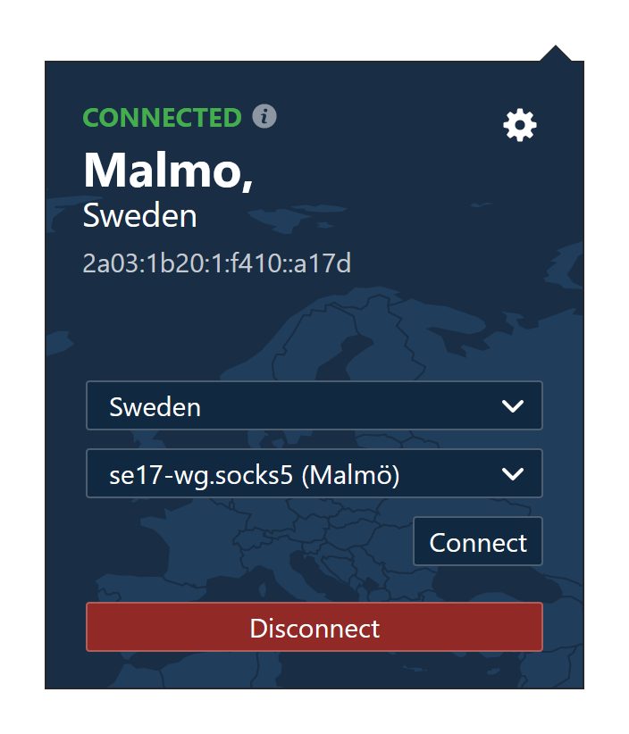

# Mullvad Proxy

Connect to a range of Mullvad proxies without manual configuration. Currently supports Firefox and Chromium-based browsers:

<a href="https://addons.mozilla.org/en-GB/firefox/addon/mullvad-proxy/" title="Get Firefox Extension"></a><a href="https://microsoftedge.microsoft.com/addons/detail/mullvad-proxy-unofficial/paapijocjajiidlalgekaomeaganninh" title="Get Edge Extension"></a>

## Usage

Ensure you're connected to Mullvad VPN before attempting to connect to a proxy, as they're only accessible internally. Connecting via WireGuard will allow a full selection of server locations, whereas OpenVPN connections are limited to the current location only.

For more info, see:  
https://mullvad.net/en/help/socks5-proxy/

Running multiple proxy extensions simultaneously may cause conflicts.


## Building

````ssh
git clone https://github.com/hensm/mullvad-proxy
cd mullvad-proxy
npm install
npm run build
````


### Build scripts

* `npm run build`  
  Builds extension and outputs to `dist/`.

* `npm run watch`  
  Same as `build`, but also rebuilds on file changes.

* `npm run start`  
  Starts a development instance of Firefox with the built extension (from `dist/`) installed. To use with other browsers, use `start:chrome` or `start:edge` scripts, or see the `-t`/`--target` web-ext option.

* `npm run package`  
  Builds and packages extension as an XPI archive. Outputs to `web-ext-artifacts/`.


## Credits

Icons by [icons8](https://icons8.com):
* `src/icons/icons8-cancel-120.png`
* `src/icons/icons8-ok-120.png`
* `src/icons/icons8-warn-120.png`
